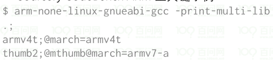
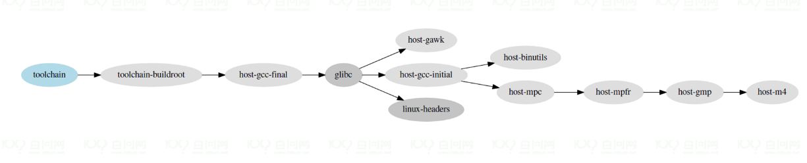
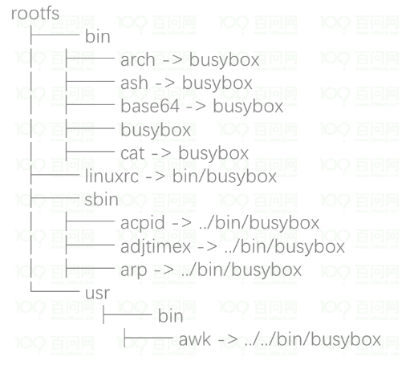

## 概念
1. 几个构建工具对比
> buildroot
* 
* 
* 
> yotco
> openwrt

## 构建根文件系统
1. uboot构建
2. kernel构建
3. rootfs构建
4. 其他构建

## 案例
1. hi3516d300构建
2. imx6ullpro构建
3. rk3399pro构建
4. 君正平台构建

## ABI(应用程序二进制接口)
1. 定义
> 从工具链的角度来看，ABI定义了
* 如何进行函数调用
* 如何传递参数
* 返回值如何传递
* 基本数据结构的大小
* 结构体成员的大小
* 当有操作系统时，如何进行系统调用
> 来自不同ABI的目标文件不能链接在一起(如果您有预构建的库或可执行文件，这一点尤其重要)
> 对于给定的CPU架构，可能存在无限数量的ABI；ABI只是关于如何使用CPU架构的规范
> 需要了解每个架构的ABI  

2. ARM 32示例
> OABI 过时的ABI，已完全弃用
> EABI： 由ARM标准化。允许将硬浮点代码与软浮点代码混合。在整数寄存器中传递浮点参数。
* 硬浮点代码：直接使用浮点指令
* 软浮点代码：使用gcc提供的用户空间库模拟浮点指令。
> EABIhf：也由ARM标准化。需要一个专门的浮点单元：只有硬浮点代码。在浮点寄存器中传递的浮点参数。
> gcc选项：
* EABI soft-float： -mabi=aapcs-linux -mfloat-abi=soft
* EABI hard-float： -mabi=aapcs-linux -mfloat-abi=softfp
* EABIhf:      -mabi=aapcs-linux -mfloat-abi=hard  

## OS的两个重要值
1. none用于bare-metal toolchains(裸机工具链)
* 用于没有操作系统的开发
* 使用的C库一般是newlib
* 提供不需要操作系统的C库服务
* 允许为特定的硬件目标提供基本的系统调用
* 可用于构建固件bootloader程序或Linux kernel，不能用于构建Linux用户空间代码。
2. linux for Linux toolchains(linux工具链)
* 用于Linux操作系统开发
* 选择特定于Linux的C库：glibc、uclibc、musl
* 支持Linux系统调用
* 可用于构建Linux用户空间代码，也可用于构建引导加载程序或内核本身等裸机代码。

## Multilib
* 大多数工具链提供一个带有C库和gcc运行时库的sysroot
* 这些为目标构建的库针对特定的架构变体和ABI进行了优化
* 每个架构变体或ABI需要有一个工具链
* Multilib工具链包含多个sysroot，每个都有一个针对不同架构/ABI变体的目标库版本。
* Sourcesy CodeBench ARM工具链示例图：  

* 三个系统根：ARM5、ARM4和ARM7 Thumb-2
* 编译器会根据gcc标志选择正确的sysroot
* 每个sysroot都有不同的库变体

## 工具链和sdk的区别
> 工具链：只有编译器，binutils和C库
> SDK：一个工具链，加上一些为Target目标架构构建的的库头文件，以及在构建软件时有用的其他本地工具。
> OpenEmbedded或Yocto  Buildroot等构建系统通常可以：
* 使用现有的工具链作为输入，或构建自己的工具链
* 除了生成根文件系统之外，他们还可以生成SDK以允许应用程序开发人员为目标构建应用程序或库。 

## 获取合适的交叉编译工具链
> 获取现有的
* 来自发行版系统内：Ubuntu和Debian有许多现成的交叉编译器。
* 来自不同组织：  
1. 芯片原厂提供的交叉编译工具链
2. Bootlin社区提供的各种架构工具链
3. ARM官方提供的aarch32_aarch64工具链
4. Linaro 提供ARM和AArch64工具链，以及一些早期版本工具链
5. gnutoolchains提供可以在windows上运行的交叉编译器工具链
6. riscv-collab 提供的riscv GNU工具链  

> 自己编译构建
* Crosstool-NG，专门构建交叉编译工具链的工具。迄今为止拥有最可配置选项/并支持多种功能的。 
* 嵌入式Linux构建系统一般都知道如何构建交叉编译工具链：Yocto/OpenEmbedded,Buildroot,OpenWRT等。

> 参考文档

## sysroot概念
> sysroot是头文件和库的逻辑根目录
> gcc 寻找头文件，ld寻找库的地方
> gcc和binutils都是使用 --with-sysroot=<SYSROOT> 参数构建的
> 内核头文件和C库安装在<SYSROOT>中
> 如果工具链已经移动到不同的位置，如果它在--prefix的子目录中，gcc仍然会找到它的sysroot，但是需要在编译时指定如下参数：
* --prefix =
* --with-sysroot = 
> 可以在运行时使用gcc的--sysroot选项覆盖
> 可以使用-print-sysroot选项打印当前的sysroot

## Toolchain内部剖析
> 
> 
> 

## 工具链组成
> Binutils二进制实用程序 
* clooection of binary tools(二进制工具集)
* 主要工具：
1. ld，链接器。将多个目标文件链接到共享库，可执行文件和另一个目标文件中。
2. as，汇编器。以文本形式获取特定于体系结构的汇编代码，并使用二进制代码生成相应的目标文件。
* 调试/分析工具和其他工具
1. addr2line,ar,c++filt,gold,gprof,nm,objcopy,objdump,ranlib,readelf,size,strings,strip。
* 需要针对每个CPU架构进行配置：您的原生x86 binutils无法生成ARM代码
* 交叉编译比较简单，不需要特殊的依赖项  

> GCC   
* GNU编译器集合
* 许多源语言的前端：C、C++、Fortan、Go等
* 许多CPU架构的后端
* 提供
1. 编译器本身，ccl代表C，cclplus代表C++，只生成文本格式的汇编代码 
2. 编译器驱动程序gcc、g++，它驱动编译器本身，也驱动binutils汇编器和链接器
3. 目标库：libgcc(gcc 运行时)，libstdc++(C++库)，libgfortran（Fortran运行时）
* 构建gcc比构建binutils稍微复杂一点：需要后面两个依赖()   

> Linux内核头文件  
* 为了构建C库，需要Linux内核头文件：包含系统调用符号的定义、各种结构类型和定义。
* 在内核中，头文件分为：
1. 用户空间可见的头文件，存储在uapi目录中：include/uapi/,arch/<ARCH>/include/uapi/asm
2. 内部内核头文件
* 安装使用
1. make ARCH=.. INSTALL_HDR_PATH=... headers_install
2. 安装包括一个特定权限，用于从头文件中删除特定的内核结构体
3. 对于Linux 4.8开始，安装了756个头文件  
* 内核到用户空间ABI向后兼容
* 工具链3.10内核头文件，在目标上运行4.4内核，可以
* 工具链4.8内核头文件，在目标上运行4.4内核，不可以

> C库  
* 提供POSIX标准的库，以及其他几个标准和扩展
* 基于Linux系统调用
* 几种可用的实现方式
1. glibc
2. uClibc-ng(原uClibc)
3. musl
4. bionic,对于安卓系统
* 其他一些更特殊的C库，newlib(用于裸机)、dietlibc、klibc
* 编译安装后，提供
1. 动态链接器，ld.so
2. C库本身 libc.so，及其配套库：libm，librt，libpthread，libutil，libnsl，libresolv，libcrypt
3. C库头文件，stdio.h，stdlib.h等

除了这些之外，构建gcc本身还要一些依赖库

## 整体构建过程
1. 构建binutils
2. 构建gcc的依赖，mpfr，gmp，mpc
3. 安装Linux内核头文件
4. 构建第一阶段的gcc：不支持C库，只支持静态链接
5. 使用第一阶段的gcc构建C库
6. 构造最终的gcc，带有C库并支持动态链接。  

  

## 架构调优
1. 
2. 
3. 
4. 

## bootloader
> 
> 
> 

## kernel 移植
> 
> 
> 

## 为什么需要busybox
> Linux需要一组基本的程序才能工作
* 一个init程序
* 一个shell
* 用于文件操作和系统配置的各种基本实用程序
> 在普通的GNU/Linux系统中，这些程序由不同的项目组成
* coreutils，bash，grep，sed，tar，wget，modutils等都是不同的项目
* 许多不同的组件要集成
* 设计时未考虑到嵌入式系统限制的组件：它们的可配置性不强但具有广泛的光能
> Busybox是一种替代解决方案，在嵌入式系统中极为常见

## Busybox 介绍
> 重写了很多有用的UNIX命令行实用程序
> busybox被誉为嵌入式的瑞士军刀
> 许可证是GNU GPLv2
> busybox的替代品：Toybox，BSD许可

## Busybox在根文件系统
  

## 如何使用rootfs
* mount 和 umount是基于文件系统的
* 第一个文件系统需要通过root = 内核选项进行设置
* 如果没有可用的根文件系统，会kernel panic  

## 根文件系统存放的位置
> 可从不同位置挂载
* 从硬盘分区
* 从U盘分区
* 从SD卡分区
* 从NAND闪存芯片或类似类型的存储设备的分区
* 从网络，使用NFS协议
* 从闪存中，使用预加载的文件系统(通过引导加载程序)
* 等等
> 系统设计者可以为系统选择配置，并使用root=配置内核行动  

## 从存储设备挂载rootfs
> 硬盘或者U盘设备的分区  
* root=/dev/sdXY,X表示设备的字母，Y是表示分区的数字
* /dev/sdb2是第二个磁盘驱动器(USB key 或 ATA硬盘驱动器)的第二个分区
> SD卡设备的分区
* root=/dev/mmcblkXpY, X表示设备的数字，Y是表示分区的数字
* /dev/mmcblk0p2是第一个设备的第二个分区
> 闪存设备的分区
* root=/dev/mtdblockX,其中X是分区号
* /dev/mtdblock3 是系统列举的第四个flash分区(可以由多个flash芯片)

## NFS挂载rootfs
* 无需重新启动即可轻松更新根文件系统上的文件
* 即使您不支持内部或外部存储，也可以拥有一个很大的根文件系统
* 根文件系统可能很大

## 在内存中运行根文件系统 initramfs
> 可以使用内存中的文件系统来引导系统：initramfs
> 来自集成到内核映像中的压缩CPIO镜像
> 从Boot-loader加载到内存中
> 在启动时，此存档被提取到Linux文件缓存中
> 在两种情况下很有用：
* 快速启动很小的根文件系统。 
* 作为切换到真正根文件系统之前的中间步骤，位于需要不属于内核印象的驱动程序(存储驱动程序、文件系统驱动程序、网络驱动程序)的设备上。
> 参考(在内核文档中:filesystem/ramfs-rootfs-initramfs

## Kernel内部使用initramfs
> 
> 
> 
> 